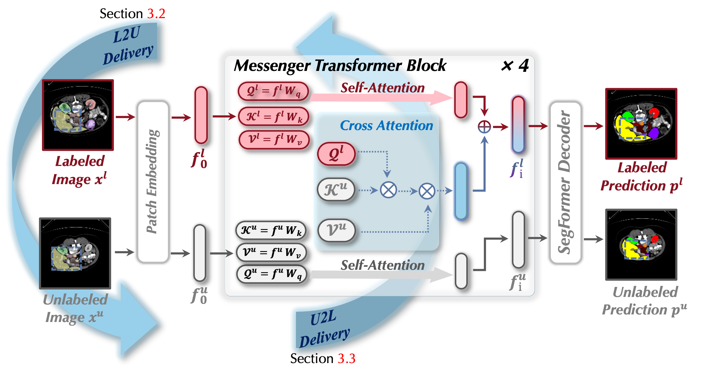
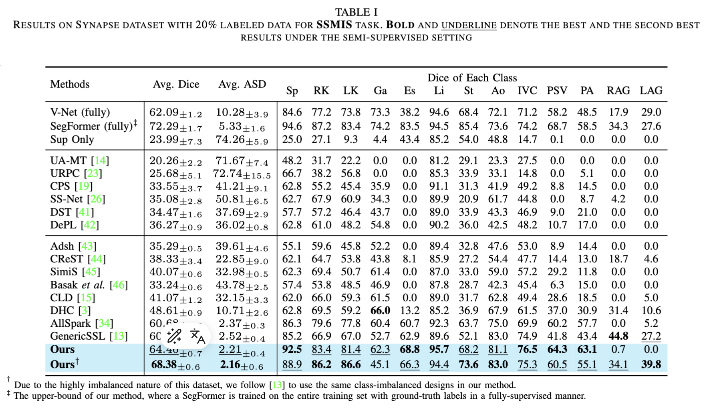
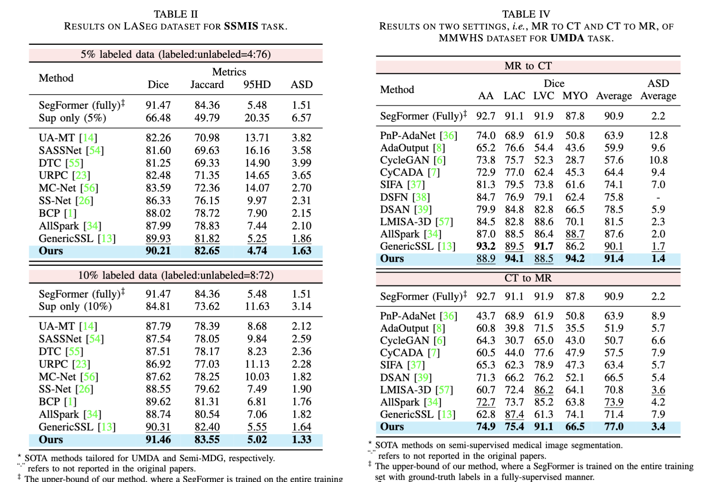
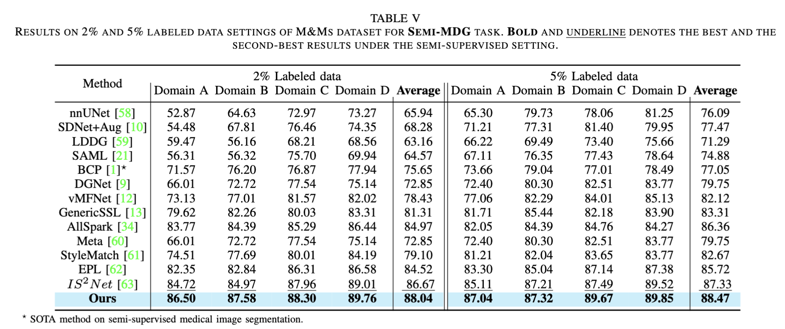

<div align=center>
<h1> S&D Messenger: Exchanging Semantic and Domain
Knowledge for Generic Semi-Supervised Medical
Image Segmentation </h1>
</div>
<div align=center>

<a src="https://img.shields.io/badge/%F0%9F%93%96-ICCV_2023-red.svg?style=flat-square" href="https://arxiv.org/abs/2407.07763">

</a>

<a src="https://img.shields.io/badge/%F0%9F%9A%80-xmed_Lab-ed6c00.svg?style=flat-square" href="https://xmengli.github.io/">

</a>
</div>

## :rocket: Updates & Todo List
:bangbang: IMPORTANT: This version is not the final version. There are still a lot of todos. We will release the final version ASAP. Sorry for any inconvenience this may cause.
- [x] Create the repository and the ReadMe Template
- [x] Release the training and testing codes for S&D-Messenger
- [ ] Release the pre-processed datasets (Synapse, MMWHS, LASeg, M&Ms, AMOS)
- [ ] Release the model weights for Synapse dataset (20%, 40% labeled)
- [ ] Release the model weights for MMWHS (CT2MRI, MRI2CT)
- [ ] Release the model weights for LASeg (5%, 10%)
- [ ] Release the model weights for M&Ms (Domain A, Domain B, Domain C, Domain D)

## :star: Introduction

SSMIS has emerged as a promising solution to tackle the challenges of time-consuming manual labeling in the medical field. However, in practical scenarios, there are often domain variations within the datasets, leading to derivative scenarios like Semi-MDG and UMDA. We aim to develop a generic framework that masters all three tasks. We notice a critical shared challenge across three scenarios: the explicit semantic knowledge for segmentation performance and rich domain knowledge for generalizability exclusively exist in the labeled set and unlabeled set respectively. Such discrepancy hinders existing methods from effectively comprehending both types of knowledge under semi-supervised settings. To tackle this challenge, we develop a Semantic & Domain Knowledge Messenger (S&D Messenger) which facilitates direct knowledge delivery between the labeled and unlabeled set, and thus allowing the model to comprehend both of them in each individual learning flow. Equipped with our S&D Messenger, a naive pseudo-labeling method can achieve huge improvement on ten benchmark datasets for SSMIS (+7.5%), UMDA (+5.6%), and Semi-MDG tasks (+1.14%), compared with SOTA methods designed for specific tasks.


## :hammer: Installation
- Main python libraries of our experimental environment are shown in [requirements.txt](./requirements.txt). You can install S&D-Messenger following:
```shell
git clone https://github.com/xmed-lab/SD-Messenger.git
cd SD_Messenger
conda create -n SDMessenger
conda activate SDMessenger
pip install -r ./requirements.txt
```

## :computer: Prepare Dataset

Download the pre-processed datasets and splits from the following links:

<table>
    <tr align="center">
        <td>Dataset</td>
        <td colspan="2">Synapse Dataset</td>
        <td colspan="2">MMWHS Dataset</td>
        <td colspan="4">M&Ms Dataset</a></td>
        <td colspan="2">LASeg Dataset</td>
    </tr>
    <tr align="center">
        <td>Paper Link</td>
        <td colspan="2"><a href="https://arxiv.org/pdf/2309.03493">Link</a></td>
        <td colspan="2"><a href="https://www.sciencedirect.com/science/article/pii/S1361841516000219">Link</a></td>
        <td colspan="4"><a href="https://ieeexplore.ieee.org/document/9458279">Link</a></td>
        <td colspan="2"><a href="https://arxiv.org/abs/2004.12314">Link</a></td>
    </tr>
    <tr align="center">
        <td>Numpy</td>
        <td colspan="2"><a href="#">Link</a></td>
        <td colspan="2"><a href="#">Link</a></td>
        <td colspan="4"><a href="#">Link</a></td>
        <td colspan="2"><a href="#">Link</a></td>
    </tr>
    <tr align="center">
        <td>Splits</td>
        <td><a href="./SD_Messenger/splits/synapse/1_5/">20%</a></td>
        <td><a href="./SD_Messenger/splits/synapse/2_5/">40%</a></td>
        <td><a href="#">CT2MRI</a></td>
        <td><a href="#">MRI2CT</a></td>
        <td><a href="#">Domain A</a></td>
        <td><a href="#">Domain B</a></td>
        <td><a href="#">Domain C</a></td>
        <td><a href="#">Domain D</a></td>
        <td><a href="#">5%</a></td>
        <td><a href="#">10%</a></td>
    </tr>
</table>


- Place the split files in ./splits
- Specify the dataset root path in the config files

## :key: Train and Evaluate S&D-Messenger

- Train S&D-Messenger on Synapse, LASeg, MMWHS, M&Ms datasets:
   - Place the dataset and split files in the corresponding folder path
   - The model of S&D-Messenger is defined in [./SD_Messenger/model](./src/model), with a backbone, and a SDMessengerTransformer
   - You can train S&D-Messenger on different datasets
```shell
cd ./SD_Messenger

# Synapse Dataset
bash scripts/train_synapse.sh ${GPU_NUM} ${PORT}
# LASeg Dataset
bash scripts/train_laseg.sh ${GPU_NUM} ${PORT}
# MMWHS Dataset
bash scripts/train_mmwhs.sh ${GPU_NUM} ${PORT}
# M&Ms Dataset
bash scripts/train_mm.sh ${GPU_NUM} ${PORT}
```

- Train S&D-Messenger on Synapse, LASeg, MMWHS, M&Ms datasets:
```shell
# Synapse Dataset
bash scripts/test_synapse.sh ${GPU_NUM} ${PORT}
# LASeg Dataset
bash scripts/test_laseg.sh ${GPU_NUM} ${PORT}
# MMWHS Dataset
bash scripts/test_mmwhs.sh ${GPU_NUM} ${PORT}
# M&Ms Dataset
bash scripts/test_mm.sh ${GPU_NUM} ${PORT}
```


## :blue_book: Reproduced Results

***To improve the reproducibility of the results, we have shared the trained model weights and training logs for your reference.***

<table>
    <tr align="center">
        <td> Dataset </td>
        <td colspan="2">Synapse Dataset</td>
        <td colspan="2">MMWHS Dataset</td>
        <td colspan="4">M&Ms Dataset</td>
        <td colspan="2">LASeg Dataset</td>
    </tr>
    <tr align="center">
        <td> Splits </td>
        <td>20%</td>
        <td>40%</td>
        <td>CT2MRI</td>
        <td>MRI2CT</td>
        <td>Domain A</td>
        <td>Domain B</td>
        <td>Domain C</td>
        <td>Domain D</td>
				<td>5%</td>
        <td>10%</td>
    </tr>
    <tr align="center">
        <td> DICE (%)</td>
        <td>64.46</td>
        <td>68.07</td>
        <td>77.0</td>
        <td>91.4</td>
        <td>86.50</td>
        <td>87.58</td>
        <td>88.30</td>
        <td>89.76</td>
				<td>90.21</td>
        <td>91.46</td>
    </tr>
   <tr align="center">
        <td> Model Weights </td>
        <td><a href="#">weight</a></td>
        <td><a href="#">weight</a></td>
        <td><a href="#">weight</a></td>
        <td><a href="#">weight</a></td>
        <td><a href="#">weight</a></td>
        <td><a href="#">weight</a></td>
        <td><a href="#">weight</a></td>
        <td><a href="#">weight</a></td>
				<td><a href="#">weight</a></td>
        <td><a href="#">weight</a></td>
    </tr>
  <tr align="center">
        <td> Training Logs </td>
        <td><a href="#">log</a></td>
        <td><a href="#">log</a></td>
        <td><a href="#">log</a></td>
        <td><a href="#">log</a></td>
        <td><a href="#">log</a></td>
        <td><a href="#">log</a></td>
        <td><a href="#">log</a></td>
        <td><a href="#">log</a></td>
				<td><a href="#">log</a></td>
        <td><a href="#">log</a></td>
    </tr>

</table>

## :dart: Results




## :books: Citation

If you find our paper helps you, please kindly consider citing our paper in your publications.
```bash
@article{zhang2024s,
  title={S\&D Messenger: Exchanging Semantic and Domain Knowledge for Generic Semi-Supervised Medical Image Segmentation},
  author={Zhang, Qixiang and Wang, Haonan and Li, Xiaomeng},
  journal={arXiv preprint arXiv:2407.07763},
  year={2024}
}
```

## :beers: Acknowledge

We sincerely appreciate these three highly valuable repositories [UniMatch](https://github.com/LiheYoung/UniMatch), [SegFormer](https://github.com/NVlabs/SegFormer) and [A&D](https://github.com/xmed-lab/GenericSSL).

